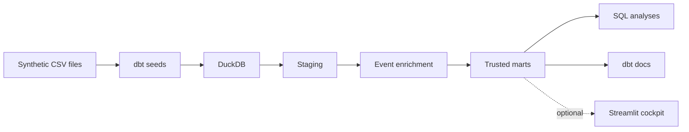
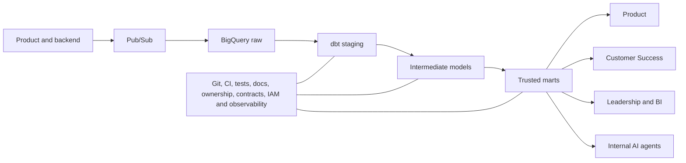

# Lexroom Analytics Engineer case

> Trustworthy data for trustworthy AI.

This repository is a small, reproducible first slice of an analytics foundation for Lexroom's AMA product. It turns imperfect synthetic product data into decision-ready dbt marts for Product, Customer Success and Leadership, then exposes those marts through short SQL analyses and dbt documentation.

## What I built

- Four staging models with deterministic deduplication, transparent source cleaning and preserved audit fields.
- One event-grain intermediate model that aggregates feedback before joining, preventing row expansion.
- Three marts at module-week, workspace and week grain.
- Targeted data tests covering keys, relationships, formula invariants, signal conservation, trusted-layer failures and known source-quality warnings.
- Three short answer queries and three dbt exposures.
- CI and a two-page [90-day strategy memo](docs/memo_90_days.pdf) ([source](docs/memo_90_days.md)).

The reviewed submission is the dbt project, its analyses and the 90-day memo. A small Streamlit cockpit is retained under `dashboard/` as an optional demonstration only; it is not required to review or reproduce the case. The optional engineering PR/DORA dataset is deliberately out of scope because the core AMA decision system is complete without it.

## Quick start

```bash
git clone https://github.com/teoparis/lexroom-analytics-engineer-case.git
cd lexroom-analytics-engineer-case
python3 -m venv .venv
source .venv/bin/activate
pip install -r requirements.txt
dbt seed --profiles-dir .
dbt build --profiles-dir .
python scripts/validate_metrics.py
dbt docs generate --profiles-dir .
```

For an exact reviewer-oriented reproduction, run `make setup && make audit`. The audit profiles the sources, builds and tests dbt, independently recomputes every published metric row, generates dbt docs and checks that the committed JSON receipts are current.

## Why this architecture

DuckDB is the execution environment for the take-home. BigQuery remains the production architecture. The local setup needs no cloud account, credentials or billing and keeps the review focused on grains, semantics and quality.

| Decision | Take-home choice | Why | Production evolution |
|---|---|---|---|
| Warehouse | DuckDB | Reproducible local execution | BigQuery EU |
| Transformation | dbt Core | Versioned SQL, tests and lineage | dbt on BigQuery |
| Source loading | dbt seeds | Appropriate for static synthetic files | Existing Pub/Sub to BigQuery ingestion |
| Orchestration | None | Unnecessary for a static case | Choose after frequency and dependency requirements are known |
| Visualization | SQL analyses and dbt docs | Keeps the required submission focused | Existing BI or product surface after consumer needs are validated |
| Privacy | Data minimization | Synthetic IDs remain useful and free text stays restricted | IAM, pseudonymization and restricted text access |
| CI | GitHub Actions | Metric changes are tested like software | Integrate with production release controls |

## Architecture

The brief describes React and TypeScript, Python on Cloud Run, Pub/Sub into BigQuery EU, and Elasticsearch plus Pinecone, with dbt not yet established. The two diagrams below distinguish the executable take-home from its proposed production evolution; they are not competing architectures.

### Take-home implementation



### Proposed production evolution



## Data model and grains

| Model | Grain | Purpose |
|---|---|---|
| `stg_events_ama` | One unique AMA event | Canonical modules and valid latency, with raw values retained |
| `stg_feedback_ama` | One unique feedback record | Valid thumbs and normalized reason tags, including orphan visibility |
| `stg_users` | One user | User/workspace relationship and deletion status |
| `stg_workspaces` | One known workspace | Country, plan and firm-size context |
| `int_ama_events_enriched` | One AMA event | Feedback counts and relevant dimensions without raw free text |
| `mart_ama_module_weekly` | One module per week | Product quality, reach, sample and latency trends |
| `mart_workspace_health` | One known workspace | Recent versus previous four-week experience deterioration |
| `mart_ama_quality_weekly` | One week | Leadership North Star and component guardrails |

The analytical anchor is the dataset's maximum event date, 19 April 2026. The reported eight weeks run from Monday 23 February through Sunday 19 April 2026, so the result remains reproducible.

## Business answers

### 1. Product: where to focus

All six point estimates deteriorated in positive feedback between the first and second four-week windows. The independent validation also calculates a descriptive 95% Newcombe-Wilson interval for each change, so magnitude does not get confused with certainty.

| Module | Previous 4w feedback | Recent 4w feedback | Positive-rate change | Descriptive 95% interval | Critical-issue change | Recent events |
|---|---:|---:|---:|---:|---:|---:|
| amministrativo | 72 | 18 | -18.1 pp | -41.1 to +5.8 pp | +15.3 pp | 75 |
| societario | 228 | 74 | -14.7 pp | -27.2 to -2.6 pp | +12.0 pp | 279 |
| tributario | 127 | 50 | -11.2 pp | -26.7 to +3.5 pp | -0.6 pp | 191 |
| civile | 569 | 203 | -10.3 pp | -17.8 to -3.1 pp | +5.6 pp | 789 |
| lavoro | 285 | 74 | -7.4 pp | -19.8 to +3.9 pp | +2.6 pp | 319 |
| penale | 156 | 56 | -4.3 pp | -18.4 to +7.8 pp | +1.1 pp | 163 |

Recommended focus:

1. `societario` for a severe deterioration whose interval remains below zero.
2. `civile` for a supported deterioration with the largest event reach.
3. `amministrativo` as an investigation signal. Its point estimate is sharp, but 18 recent valid feedback records leave a wide interval that crosses zero.

The intervals are descriptive checks for independent received-feedback proportions. They do not correct feedback self-selection or multiple module comparisons. These are prioritization signals, not causal diagnoses. Product should next inspect reason detail, product releases and retrieval quality for the affected module-periods.

### 2. Customer Success: experience deterioration

The risk score measures deterioration only:

```text
100 × (50% satisfaction deterioration
     + 30% performance deterioration
     + 20% relative engagement deterioration)
```

Engagement uses each workspace's share of platform activity, not raw event decline. Plan and firm size remain outside the score.

The strongest actionable signals are:

- `ws_0041`: 26.8 risk, high confidence, driven mainly by a 53.3 percentage-point satisfaction decline.
- `ws_0051`: 24.6 risk, high confidence, with satisfaction, latency and relative engagement all worsening.
- `ws_0077`: 32.7 risk, medium confidence. The score is higher, but the recent feedback sample is nine.

`ws_0052` has the highest raw score, 55.2, but only one valid feedback record in each window. It should not outrank better-supported signals without investigation. Forty-three of 80 workspaces have all three comparable risk components; missing score components remain null.

### 3. Leadership: provisional operating North Star

```text
100 × (50% Positive Feedback Rate
     + 30% Critical-Issue Avoidance Rate
     + 20% Latency SLO Rate)
```

The provisional latency threshold is five seconds and is a case assumption, not an official Lexroom SLA.

| Week starting | Score | Events | Valid feedback | Feedback coverage |
|---|---:|---:|---:|---:|
| 23 Feb | 80.0 | 1,714 | 448 | 26.1% |
| 2 Mar | 84.4 | 1,492 | 394 | 26.4% |
| 9 Mar | 84.6 | 1,180 | 317 | 26.9% |
| 16 Mar | 83.0 | 989 | 278 | 28.1% |
| 23 Mar | 78.2 | 840 | 229 | 27.3% |
| 30 Mar | 74.7 | 552 | 142 | 25.7% |
| 6 Apr | 76.6 | 322 | 84 | 26.1% |
| 13 Apr | 64.2 | 102 | 20 | 19.6% |

The decline is material, but the final week has the smallest sample and lowest coverage. The score must always travel with its components, feedback count and feedback coverage.

The score measures the operational signals available in the synthetic case. It does not evaluate citation entailment, source authority, jurisdictional correctness, corpus freshness or whether the model should have abstained. Those require a claim-level legal evaluation layer before this proxy can represent end-to-end legal answer quality.

## Fresh data-quality profile

The committed `scripts/profile_data.py` reproduces `docs/data_profile.json` from the supplied seeds.

| Issue | Verified count | Treatment | Why |
|---|---:|---|---|
| Duplicate AMA event rows | 5 | Deterministic deduplication | Event grain must be unique |
| Duplicate feedback rows | 15 | Deterministic deduplication | Feedback grain must be unique |
| Orphan feedback after deduplication | 50 | Preserve in staging, exclude from enrichment | No valid event relationship |
| Invalid thumbs after deduplication | 16 | Clean value becomes null | Prevent satisfaction corruption |
| Negative latency | 33 | Clean latency becomes null, raw value retained | Physically invalid for analytics |
| Events with zero retrieved chunks | 66 | Preserve as valid | Diagnostic signal, not automatic error |
| Users with missing workspace parent | 3 | Warning | Do not fabricate dimension mappings |
| Events with missing workspace parent | 8 | Warning | Preserve event facts and relationship gap |
| Workspaces with missing country | 3 | Expose `UNKNOWN`, retain raw null | Consumption clarity without inference |
| Events before user creation | 817 | Warning only | Source semantics are not known |
| Events before workspace signup | 597 | Warning only | Source semantics are not known |

The duplicate groups are exact rather than conflicting, no deduplicated event has multiple feedback records, and the 26 deleted users have no events in this snapshot. The implementation still protects event grain and preserves historical-event semantics rather than depending on those convenient properties.

The 28 valid extreme latencies of 900 seconds remain in the analytical data. Cached traffic has a 119 ms median versus 3,223 ms for non-cached traffic, so cached status is retained as a diagnostic rather than mixed into the quality definition.

## Metric definitions and limitations

- **Positive feedback rate:** positive received feedback divided by valid received feedback. Feedback is self-selected, so this does not estimate the share of all users who are satisfied.
- **Critical issue:** valid feedback tagged `wrong_answer` or `hallucination`.
- **Latency SLO rate:** share of events with valid latency at or below the provisional five-second threshold.
- **Risk confidence:** high requires at least 30 events and 10 valid feedback records in both windows; medium requires 10 events and 3 feedback records; otherwise low.
- **Retrieval coverage:** useful operational evidence, but retrieved chunks do not prove that sources were correct or legally reliable.
- **Jurisdiction:** the case treats `module_tag` as shared across IT, DE and ES. Production analysis should verify that module semantics are comparable before cross-country conclusions.

## Quality philosophy

Source problems become visible warnings. Trusted-layer contract violations fail the build. This keeps CI green without hiding synthetic source defects. The forty tests protect grain, keys, accepted values, valid ranges, clean latency, feedback-count conservation, score formulas, risk completeness and relationships introduced by transformations.

`scripts/validate_metrics.py` independently recomputes all 8 leadership weeks, all 48 module-week rows and all 80 workspace rows with pandas. It also emits the Product uncertainty analysis and a committed validation receipt, reducing the risk of stale hand-copied numbers.

## Privacy and data minimization

The supplied IDs are synthetic, so hashing them would add cosmetic pseudonymization without protecting real people. The project instead applies privacy by consumption:

- Restricted staging retains identifiers and feedback text for controlled investigation.
- The analytical core uses stable identifiers and controlled dimensions, without free text.
- Business marts expose only metrics and minimum necessary context. The optional Streamlit view reads those marts rather than the raw seeds.

In production, stable pseudonymous identifiers, IAM, restricted raw text, retention rules and purpose-based access should be added. Hashing alone would be pseudonymization, not anonymization.

## AI-assisted workflow

I used ChatGPT and Codex as permitted accelerators for requirement decomposition, profiling support, SQL and dbt scaffolding, test drafting, documentation editing and the optional Streamlit prototype. I remained responsible for the model grains, source-treatment rules, metric definitions, business prioritization and final trade-offs.

AI-generated or AI-assisted work was not accepted on output alone: `dbt build` verifies model contracts and tests, while `scripts/validate_metrics.py` independently recomputes every published mart row with pandas. I also reviewed the resulting SQL and documented where the available data supports only a proxy rather than the underlying legal-AI quality claim.

## Trade-offs and known limitations

- Static seeds and full-refresh tables keep the case reproducible. Production scale would justify incremental models, partitioning and clustering based on real access patterns.
- The five-second threshold is provisional.
- Workspace risk measures experience deterioration, not churn probability.
- The final week is complete by calendar boundary but much smaller in volume. A source freshness or synthetic-generation issue may explain it.
- Temporal inconsistencies remain uncorrected because backfill and source semantics are unknown.
- The cockpit is local and intentionally omits authentication and deployment.

## What I would do next with more time

I would prioritize the next work in this order:

1. Validate the three decision interfaces with Product, Customer Success, Sales and Engineering before promoting any case assumption to a governed KPI.
2. Port a fixed snapshot to separate BigQuery development and production datasets and reconcile it against DuckDB before introducing incremental models.
3. Agree a versioned AMA event contract, ownership and tiered freshness expectations; then monitor volume, freshness and critical test failures.
4. Add jurisdiction, corpus and model-version context, followed by claim-level evaluation of citation support, authority and temporal validity with legal or AI-quality experts.
5. Add partitioning, clustering, orchestration, broader self-service and agent access only after real query patterns and decision cadences justify them.

BigQuery solves storage and compute scale; analytics engineering must also solve semantic scale as countries, modules, teams and use cases grow. Lexroom's public 8 September 2026 update describes five European markets and more than 13 million connected legal sources. Its citability narrative defines trust at claim and source level. Those facts make jurisdiction, source lineage and claim-level evaluation a more relevant path than adding generic analytics tooling. Public context remains separate from the synthetic case evidence.

See [the 90-day memo](docs/memo_90_days.md) for the proposed sequence. Complexity should follow demonstrated need.

## Optional dashboard extra

The Streamlit cockpit is a local convenience layer over the three trusted marts, not a required deliverable and not an additional metric implementation. After completing the core setup, start it with:

```bash
make dashboard
```

It intentionally omits authentication and deployment; a production visualization should use Lexroom's chosen BI or product surface only after audience and access requirements are known.
